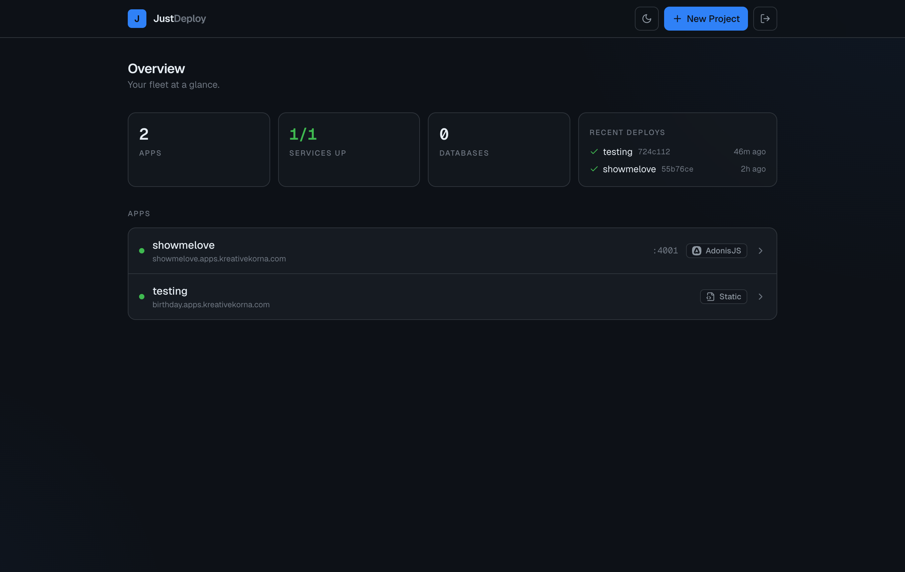
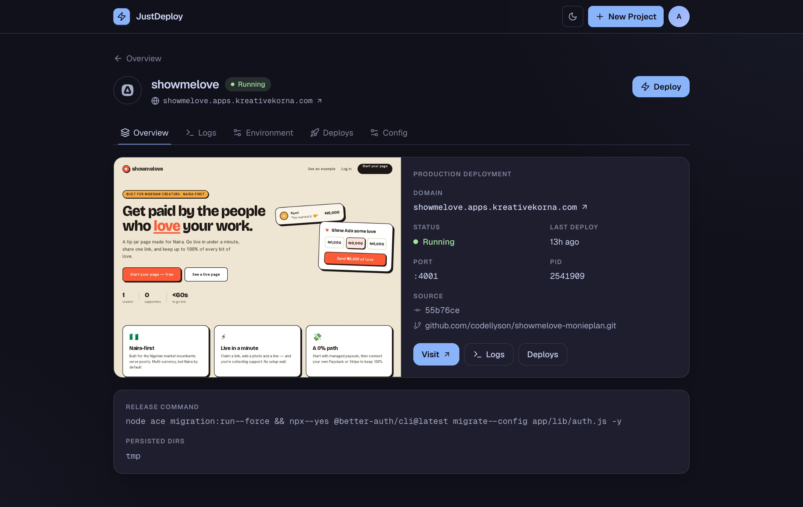
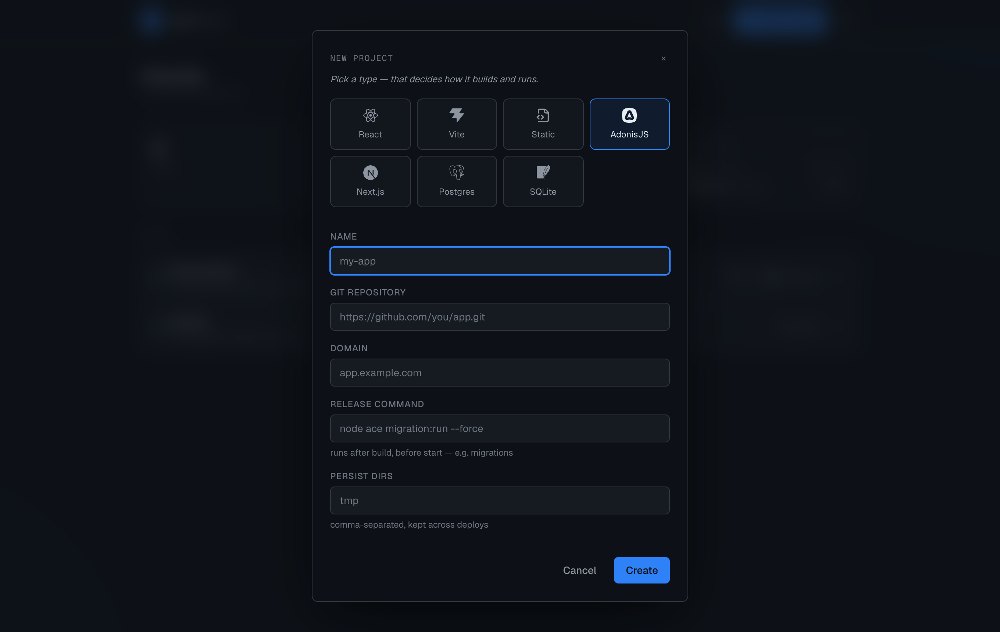

# JustDeploy

Lean, single-server deploy platform for a fixed menu of app types. Bring your own VPS —
Docker + Caddy do the heavy lifting. No accounts, no forms: pick a type, point it at a repo,
done. Ships a CLI **and** a React control panel.

**What you get:** zero-downtime deploys · self-diagnosing failures (plain-English reason + fix) ·
live build-log streaming · process supervision (crashed apps self-heal) · one-command rollback ·
git-push auto-deploy · S3 / R2 backups · a Vercel-style dashboard built on the
[justui](https://github.com/codellyson/justui) design system with six themes.

See [CONCEPT.md](CONCEPT.md) for the design, [GAPS.md](GAPS.md) for the honest roadmap, and
[docs/port-swap.md](docs/port-swap.md) for the one genuinely stateful operation.

## Screenshots

**Overview** — your fleet at a glance: services up, recent deploys, every app.



**Per-app pages** — status, live logs, deploy history + rollback, env, and config, all in tabs.



**New project** — the type picker *is* the configuration; it decides how the app builds and runs.



## Quick start

On a fresh Ubuntu VPS with your domain's DNS pointed at it, one command installs everything —
Node, the CLI, then Caddy + Docker via `justdeploy setup`:

```sh
curl -fsSL https://raw.githubusercontent.com/codellyson/justdeploy/master/install.sh | bash

# deploy your first app — the type decides build + run, and Caddy gets a Let's Encrypt cert
justdeploy add https://github.com/you/site.git --type vite --domain app.example.com

# optional: the web control panel (builds the React UI, served with TLS by Caddy)
justdeploy dashboard install --domain panel.example.com

# optional: git push -> auto-deploy
justdeploy webhook
```

Prefer to do it by hand? Install Node ≥ 22.5, then `git clone … && npm link`, then run
`justdeploy setup` (installs + wires up Caddy and Docker) and `justdeploy doctor` to verify.
Full walkthrough: **[docs/install.html](docs/install.html)**.

## Requirements (on the server)

`justdeploy setup` installs and configures Caddy and Docker for you on Debian/Ubuntu, so in
practice the only thing you provide is **Node ≥ 22.5** (needed to run the CLI itself). For
reference, the full set:

- **Node ≥ 22.5** (uses the built-in `node:sqlite`; on Node 23 it prints an experimental
  warning — silenced with `NODE_OPTIONS=--disable-warning=ExperimentalWarning`)
- **Caddy** with its admin API on `localhost:2019` — *installed by `justdeploy setup`*
- **Docker** (only for the `postgres` resource) — *installed by `justdeploy setup`*
- **git**

Run `justdeploy doctor` any time to see which of these are present and reachable.

## Install

One command on a fresh Debian/Ubuntu box (installs Node, clones, links the CLI, then runs
`justdeploy setup`):

```
curl -fsSL https://raw.githubusercontent.com/codellyson/justdeploy/master/install.sh | bash
```

Or by hand:

```
git clone <this repo> /opt/justdeploy
cd /opt/justdeploy
npm link            # or: ln -s /opt/justdeploy/bin/justdeploy /usr/local/bin/justdeploy
justdeploy setup    # installs + wires up Caddy and Docker; idempotent, run as root
justdeploy doctor   # check prerequisites without changing anything
```

`justdeploy setup` handles the system dependencies (Caddy with its admin API, Docker for
Postgres) on Debian/Ubuntu; pass `--no-docker` to skip Docker. State lives in
`/var/lib/justdeploy/state.db`; apps live under `/srv/<name>/`. Override with
`JUSTDEPLOY_HOME` and `JUSTDEPLOY_SRV`.

To reverse it, `justdeploy uninstall` removes **everything** — apps, databases, Caddy (package
+ config), state, and the checkout — after printing the plan and prompting `y/N`. Flags only
hold things back:

```
justdeploy uninstall                # full removal (prompts to confirm)
justdeploy uninstall --keep-data    # keep state.db, app files, and db volumes
justdeploy uninstall --keep-caddy   # leave Caddy installed, just drop the routes
justdeploy uninstall --yes          # skip the prompt (for scripts / non-interactive)
```

Docker is always left in place (it's a shared tool). The prompt is required at a terminal;
piped/non-interactive runs need `--yes`.

## Use

```
# register an app and deploy it in one step. type is detected from the repo's package.json
# and domain is inferred as <name>.<base>, so a bare add just works:
justdeploy add https://github.com/you/site.git                        # type + domain inferred
justdeploy add https://github.com/you/api.git  --type adonis --domain api.gobi.design  # override either

# redeploy (pull → build → swap)
justdeploy deploy api
justdeploy deploy                 # all deployable apps

justdeploy ls                     # what's deployed, ports, pids
justdeploy logs api -f            # tail an app's log
justdeploy env api DATABASE_URL=postgres://...   # set one or more KEY=VAL, then redeploy
justdeploy env api --file .env                    # load a whole .env at once
justdeploy pg api                 # provision a Postgres container, prints conn string
justdeploy rollback api           # redeploy the previous successful commit
justdeploy webhook                # enable git-push auto-deploy, print the setup to paste into GitHub
justdeploy set api --release "node ace migration:run --force" --persist tmp
justdeploy reconcile              # rebuild Caddy config from the db
```

### Backups (bring your own S3 / R2)

The source of truth is `state.db`, so back it up off-box. A backup captures `state.db`, each
app's `data/` dir, and a `pg_dump` of every Postgres — not repos/logs (rebuildable). You bring
the bucket and choose the interval.

```
# point at your bucket once (works for AWS S3 and Cloudflare R2)
justdeploy backup config --endpoint https://<acct>.r2.cloudflarestorage.com \
  --bucket my-backups --access-key <k> --secret-key <s> [--region auto] [--prefix justdeploy]

justdeploy backup                 # snapshot + upload to your bucket (keeps a local copy too)
justdeploy backup --local         # snapshot locally only, no upload
justdeploy backup --keep 7        # local retention: keep newest 7
justdeploy backup --schedule daily # optional: install a systemd timer at your interval
                                    #   (or just call `justdeploy backup` from your own cron/CI)
justdeploy restore <file> --yes   # restore state.db + data dirs + postgres from a backup
```

The archive is `chmod 600` — it contains secrets (env vars, admin hash, webhook secret).

### Database-backed apps (migrations + persistence)

Two optional per-app knobs, set at `add`, via `justdeploy set`, or in the dashboard Config panel:

- `--release "<cmd>"` — runs after build, before the server starts, with the app's env
  (e.g. `node ace migration:run --force`).
- `--persist "tmp,storage"` — runtime dirs symlinked to the persistent `/srv/<name>/data/`
  area so their contents (like a SQLite file) survive the build dir being replaced each deploy.

### Supported types

| type     | serve model | what `add` auto-fills                                    |
|----------|-------------|----------------------------------------------------------|
| `react`  | static      | serves `build/` with SPA fallback                        |
| `vite`   | static      | serves `dist/` with SPA fallback                          |
| `static` | static      | serves the repo root                                     |
| `adonis` | proxy       | `APP_KEY`, `HOST=0.0.0.0`, `PORT`, `NODE_ENV`            |
| `nextjs` | proxy       | `HOSTNAME=0.0.0.0`, `PORT`, runs the standalone asset copy |
| `postgres` | resource  | `docker run` + scoped non-superuser role, TLS, localhost port |

## Config & source of truth

The **source of truth is the SQLite state db** (`/var/lib/justdeploy/state.db`), written by the
CLI and dashboard. A `justdeploy.yml` is an optional *input* to `add` (or an export snapshot),
not a live record — editing one after the fact does nothing until you re-`add`.
`justdeploy reconcile` rebuilds Caddy's live config **from the db**.

Because the db is the single record, **back it up** — `state.db` and the app data volumes under
`/srv/<name>/data` are the only irreplaceable state.

```yaml
name: gobi-design
type: vite
domain: gobi.design
postgres: gobi-db     # optional
health:               # optional, proxy types
  path: /health
  timeout: 30
```

## Status

Core engine complete and **verified end-to-end on a real server** (Ubuntu 24.04 + Caddy 2.11):

- **Static deploy** — git clone → build → Caddy live-load → HTTPS serve ✓
- **Proxy deploy + zero-downtime swap** — build → spawn → health-check → Caddy repoint →
  drain/kill old process. Verified with an availability probe: **zero dropped requests during
  the port swap** ✓
- **Postgres** — provision on `deploy-net` with no host port published, teardown of
  container + volume ✓
- **`rm`** — stops the process, drops the Caddy route, deletes files and DB rows ✓
- **Process supervision** — a supervisor relaunches any proxy app whose process dies (crash
  or reboot), same port/no rebuild, with backoff. Verified: `kill -9` → back up in ~6s ✓
- **Rollback** — `justdeploy rollback <name>` / dashboard button redeploys the previous
  successful commit ✓
- **Self-service failures** — deploy failures show a plain-English reason + fix (CLI and
  dashboard); build/deploy logs stream live to the dashboard ✓
- **git-push auto-deploy** — a signed webhook (`POST /api/webhook`) redeploys apps matching the
  pushed repo, default-branch only. Enable with `justdeploy webhook` ✓
- **Backups** — `justdeploy backup` snapshots `state.db` + data dirs + Postgres and uploads to
  your S3/R2 bucket (zero-dep SigV4); `restore` brings it back. You bring the bucket + interval ✓

**Web dashboard** (Vercel-style control panel) — password login, new-project type-picker,
deploy/logs/env/delete, Postgres provisioning, and a live theme switcher. Built on the
`@codellyson/justui` design system (all six themes). Set it up with:

```
justdeploy dashboard install --domain panel.example.com [--password <p>]
```

It runs as a systemd service (`justdeploy-dashboard`) on 127.0.0.1:4999, served with TLS by
Caddy like any other app — JustDeploy deploys its own dashboard. Reset the password any time
with `justdeploy dashboard password <new>`.

Not built yet (deliberately deferred): the git-push webhook receiver and the "upload a
folder" static ingestion mode.
